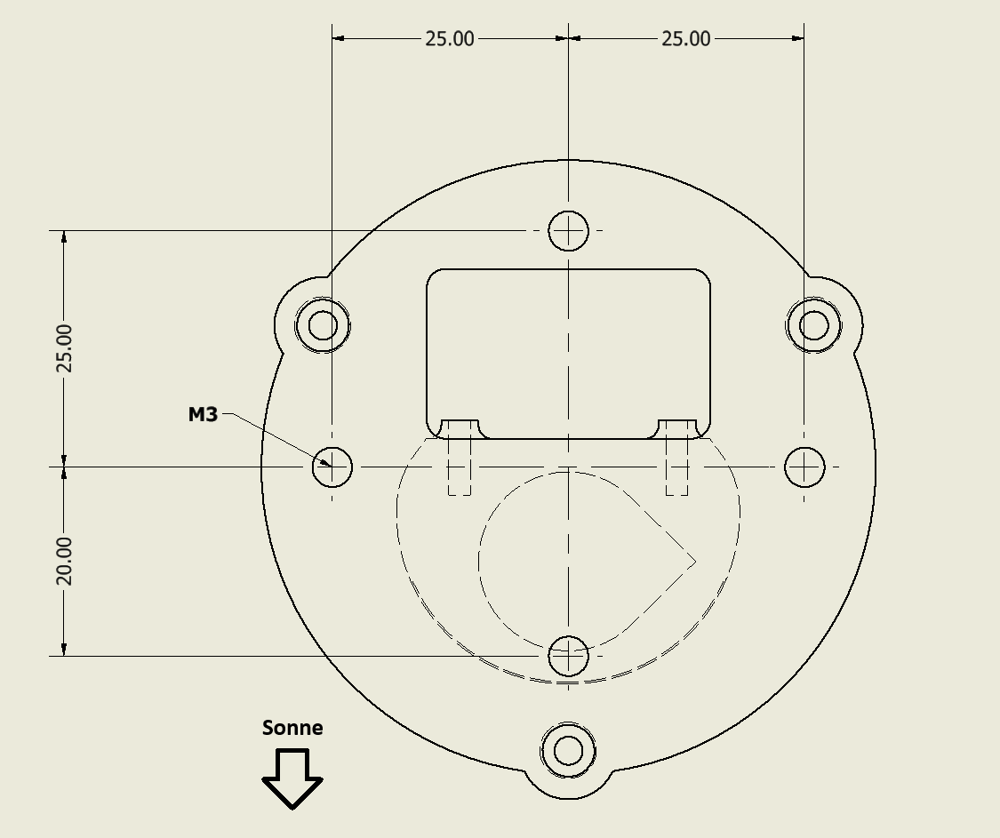

# CAI_MINI — Environmental Sensor Plattform

> Modulare IoT-Sensorplattform auf Basis des **Seeed XIAO ESP32-S3**  
> zur Erfassung von Umweltdaten und Übertragung via **WLAN/MQTT** oder **LoRa**.

---

## Inhaltsverzeichnis

- [Übersicht](#übersicht)
- [Hardware](#hardware)
- [Projektstruktur](#projektstruktur)
- [Environments / Betriebsmodi](#environments--betriebsmodi)
- [Konfiguration (INI-Datei)](#konfiguration-ini-datei)
- [Bibliotheken / Dependencies](#bibliotheken--dependencies)
- [Eigene Klassen](#eigene-klassen)
- [Ablauf WLAN-Modus](#ablauf-wlan-modus)
- [Ablauf WIND-Modus](#ablauf-wind-modus)
- [Ablauf LoRa-Modi](#ablauf-lora-modi)
- [Datenlogging (SD-Karte)](#datenlogging-sd-karte)
- [Akkuspannung & Ladestand](#akkuspannung--ladestand)
- [Home Assistant Integration](#home-assistant-integration)
- [Firmware-Update (OTA)](#firmware-update-ota)
- [LED-Statusanzeige](#led-statusanzeige)
- [Build & Flash](#build--flash)
- [Montage / Halterung](#montage--halterung)
- [Autor](#autor)

---

## Übersicht

**CAI_MINI** ist eine modulare, energieeffiziente IoT-Sensorplattform. Das System erfasst Umweltdaten (Temperatur, Luftdruck, Luftfeuchtigkeit, Gaswiderstand) mit einem **BME680-Sensor** und überträgt diese entweder direkt via **WLAN zu ThingsBoard**, via **LoRa-Mesh-Netzwerk** (Sensor → Router → Gateway), oder als Wetterstation mit **Windmessung und Regenmessung** (WIND-Modus).

---

## Hardware

| Komponente          | Beschreibung                                        |
|---------------------|-----------------------------------------------------|
| **MCU**             | Seeed XIAO ESP32-S3                                 |
| **Sensor**          | BME680 (Temperatur, Druck, Feuchte, Gas)            |
| **Speicher**        | SD-Karte (SPI) — CSV Datenlogging                   |
| **Kommunikation**   | WLAN (802.11 b/g/n) **oder** LoRa (SX1262)         |
| **Stromversorgung** | LiPo Akku (3.0 V – 4.2 V, ADC-Messung)             |
| **Konfiguration**   | INI-Datei auf SD-Karte (`/INIT.ini`)                |
| **Status-LEDs**     | LED Orange (WLAN/Status), LED Blau (Datensendung)   |
| **Wind (WIND)**     | Windfahne (ADC), Anemometer (Interrupt), Regenmesser|

---

## Projektstruktur

```
CAI_MINI/
│
├── platformio.ini                   ← Build-Konfiguration (alle Environments)
├── Example_ini_File/                ← Beispiel-INI-Dateien für alle Modi
│
├── src/
│   ├── WLAN/
│   │   └── main.cpp                 ← WLAN-Modus: Sensor → ThingsBoard via MQTT
│   ├── WIND/
│   │   ├── main.cpp                 ← Wind/Regen-Wetterstation mit WLAN
│   │   ├── wind_rain.cpp/.h         ← Wind- und Regenmessungs-Klasse
│   ├── LORA_SENSOR/
│   │   └── main.cpp                 ← LoRa Sensor: Daten erfassen & per LoRa senden
│   ├── LORA_ROUTER/
│   │   └── main.cpp                 ← LoRa Router: Pakete weiterleiten
│   └── LORA_GATEWAY/
│       └── main.cpp                 ← LoRa Gateway: Pakete empfangen & via WLAN weitersenden
│
├── lib/
│   ├── BME680/
│   │   └── BME680_Sensor.h/.cpp     ← BME680 Sensor-Wrapper
│   ├── FirmwareUpdate/
│   │   └── FirmwareUpdater.h/.cpp   ← OTA Firmware-Update via ThingsBoard
│   ├── homeassistant/
│   │   └── ha_mqtt.h/.cpp           ← Home Assistant MQTT Discovery Client
│   ├── SDCard/
│   │   └── sdcard.h/.cpp            ← SD-Karte, INI-Parsing, CSV-Logging
│   ├── LORA/
│   │   └── LORA.h/.cpp              ← LoRa-Kommunikationsklasse (RadioLib SX1262)
│   │   └── SensorPacket.h/.cpp      ← Datenpaket-Struct für LoRa-Übertragung
│   ├── battery/
│   │   └── battery.h/.cpp           ← Akkuspannungsmessung via ADC
│   ├── log/
│   │   └── log.h/.cpp               ← Logging (Serial + optional Telnet)
│   ├── WIFI/
│   │   └── wifi_functions.h/.cpp    ← WLAN-Verbindungshelfer
│   └── Time/
│       └── time_functions.h/.cpp    ← NTP-Zeitsynchronisation
│
└── include/
    ├── config_WLAN.h                ← Pin-Definitionen WLAN-Modus
    ├── config_WIND.h                ← Pin-Definitionen WIND-Modus
    ├── config_LORA_SENSOR.h         ← Pin-Definitionen LoRa-Sensor
    ├── config_LORA_ROUTER.h         ← Pin-Definitionen LoRa-Router
    └── config_LORA_GATEWAY.h        ← Pin-Definitionen LoRa-Gateway
```

---

## Environments / Betriebsmodi

| Environment                               | Board              | Beschreibung                                                    |
|-------------------------------------------|--------------------|-----------------------------------------------------------------|
| `CAI_MINI_WLAN`                           | XIAO ESP32-S3      | WLAN, BME680 → ThingsBoard via MQTT, Single-Shot-Betrieb        |
| `CAI_MINI_WIND`                           | XIAO ESP32-S3      | WLAN, BME680 + Windfahne + Anemometer + Regenmesser → ThingsBoard |
| `CAI_MINI_LORA_SENSOR`                    | XIAO ESP32-S3      | LoRa: Sensordaten erfassen und per LoRa senden                  |
| `CAI_MINI_LORA_ROUTER`                    | XIAO ESP32-S3      | LoRa: Pakete empfangen und weiterleiten                         |
| `CAI_MINI_LORA_GATEWAY_XIAO_S3`           | XIAO ESP32-S3      | LoRa Gateway mit WLAN → ThingsBoard, Telnet-Logging             |
| `CAI_MINI_LORA_GATEWAY_HELTEC_WSL_V3`    | Heltec WSL V3      | Gleich wie Gateway, aber auf Heltec-Board                       |

---

## Konfiguration (INI-Datei)

Alle Zugangsdaten und Kalibrierungswerte werden aus der Datei `/INIT.ini` auf der SD-Karte gelesen. Beispieldateien für alle Modi liegen im Ordner `Example_ini_File/`.

> ⚠️ Die `INIT.ini` niemals in ein öffentliches Git-Repository committen — in `.gitignore` eintragen!

### WLAN-Modus (`INIT_WLAN.ini`)

```ini
[WIFI]
SSID       = MeinNetzwerk
PW         = MeinPasswort

[THINGSBOARD]
TB_ADRESS  = iot.beispiel.ch
TB_TOKKEN  = mein-access-token
TB_PORT    = 1884

[BME680]
TEMPERATURE_OFFSET = -2.05
PRESSURE_OFFSET    = 0.0
HUMINITY_OFFSET    = 0.0
GAS_OFFSET         = 0.0

[homeassistant]
ha_broker    = 192.168.1.100
ha_port      = 1883
ha_device_id = CAI-Mini-01
ha_user      = meinuser
ha_pass      = meinpasswort
```

> Die `[homeassistant]`-Section ist **optional** — fehlt sie, wird HA übersprungen.

### WIND-Modus (`INIT_WIND.ini`)

```ini
[GENERAL]
SENDING_PERIOD = 10       ; Sendeintervall in Minuten

[WIFI]
SSID = MeinNetzwerk
PW   = MeinPasswort

[THINGSBOARD]
TB_ADRESS = iot.beispiel.ch
TB_TOKKEN = mein-access-token
TB_PORT   = 1884

[BME680]
TEMPERATURE_OFFSET = -2.05
PRESSURE_OFFSET    = 0.0
HUMINITY_OFFSET    = 0.0
GAS_OFFSET         = 0.0

[WIND]
DEVICE_DIRECTION  = 0.0   ; Geräteausrichtung in Grad (0° = Norden)
WIND_VANE_OFFSET  = 0.0
WIND_SPEED_OFFSET = 0.0

[RAIN]
RAIN_OFFSET = 0.0

[WINDADCVALUES]
WIND_Direction_TEST = 0   ; 1 = ADC-Rohwert-Ausgabe aktivieren
0  = 2937
1  = 1464
2  = 1682
3  = 274
4  = 312
5  = 210
6  = 645
7  = 431
8  = 1021
9  = 861
10 = 2322
11 = 2201
12 = 3782
13 = 3125
14 = 3435
15 = 2603
```

---

## Bibliotheken / Dependencies

| Bibliothek                        | Zweck                                     |
|-----------------------------------|-------------------------------------------|
| `adafruit/Adafruit BME680 Library`| BME680 Sensor-Treiber                     |
| `adafruit/Adafruit Unified Sensor`| Adafruit Sensor-Abstraktionsschicht       |
| `stevemarple/IniFile`             | INI-Datei Parsing von SD-Karte            |
| `thingsboard/ThingsBoard`         | ThingsBoard MQTT Client                   |
| `thingsboard/TBPubSubClient`      | MQTT PubSub Transport (ThingsBoard-Fork)  |
| `bblanchon/ArduinoJson`           | JSON Serialisierung / Parsing             |
| `jgromes/RadioLib @ 6.6.0`        | LoRa SX1262 Treiber (nur LoRa-Modi)       |
| `jandrassy/TelnetStream`          | Telnet-Logging (nur Gateway-Modi)         |
| `rweather/Crypto`                 | AES-Verschlüsselung (nur LoRa-Modi)       |
| `agdl/Base64`                     | Base64-Kodierung (nur LoRa-Modi)          |

---

## Eigene Klassen

### `BME680_Sensor`

Wrapper für den Adafruit BME680.

| Methode | Beschreibung |
|---|---|
| `begin()` | Sensor initialisieren |
| `set_offset(temp, press, hum, gas)` | Kalibrierungsoffsets setzen |
| `enable()` / `disable()` | Sensor ein-/ausschalten |
| `readSensor()` | Messung durchführen |
| `getTemperature()` | Temperatur in °C |
| `getPressure()` | Luftdruck in hPa |
| `getHumidity()` | Luftfeuchtigkeit in % |
| `getGasResistance()` | Gaswiderstand in Ω |

---

### `wind_rain` (nur WIND-Modus)

Klasse für Windfahne, Anemometer und Regenmesser.

| Methode | Beschreibung |
|---|---|
| `begin(vane_offset, speed_offset, rain_offset, direction, adc_table)` | Initialisierung mit Kalibrierungswerten |
| `enable_interrupts()` / `disable_interrupts()` | Interrupt-gesteuerte Messung ein-/ausschalten |
| `get_wind_direction_deg()` | Windrichtung in Grad (0–360°) |
| `get_wind_direction_raw()` | ADC-Rohwert der Windfahne (für Kalibrierung) |
| `get_wind_average()` | Mittlere Windgeschwindigkeit in m/s |
| `get_wind_gust()` | Windböe (Maximum) in m/s |
| `get_rain()` | Regenmenge in mm |
| `reset_all()` | Alle Messwerte zurücksetzen |

---

### `FirmwareUpdater`

OTA-Update via ThingsBoard HTTP.

| Methode | Beschreibung |
|---|---|
| `checkAndUpdate(server, token, version, ...)` | Prüft auf neue Firmware und führt Update durch |

---

### `HA_MQTT`

Home Assistant MQTT Discovery Client.

| Methode | Beschreibung |
|---|---|
| `connect(broker, port, user, pass)` | Verbindung zu Mosquitto herstellen |
| `publishDiscovery(device_id)` | Discovery-Config für alle Sensoren senden (retained) |
| `publishState(device_id, ...)` | Aktuelle Messwerte als JSON senden |
| `disconnect()` | Verbindung trennen |

---

### `SDCard`

SD-Karten-Verwaltung, INI-Parsing und CSV-Logging.

| Methode | Beschreibung |
|---|---|
| `init(clk, miso, mosi, cs)` | SD-Karte initialisieren |
| `readIni(path)` | INI-Datei lesen und `cfg`-Struct befüllen |
| `writeLog(entry, path)` | Zeile in CSV-Datei schreiben |
| `release()` | SD-Karte freigeben |

---

## Ablauf WLAN-Modus

Single-Shot-Betrieb — das Gerät wacht auf, sendet, und fährt herunter.

```
Einschalten
    │
    ▼
SD-Karte + INI lesen
    │
    ▼
BME680 initialisieren + Offsets setzen
    │
    ▼
WLAN verbinden (Timeout: 15 s)
    │
    ▼
Firmware-Update prüfen (OTA via ThingsBoard)
    │
    ▼
NTP Zeit synchronisieren (ch.pool.ntp.org, UTC+1)
    │
    ▼
BME680 auslesen + Akkuspannung messen
    │
    ▼
Daten auf SD-Karte loggen (/data.csv)
    │
    ▼
Telemetrie + Attribute an ThingsBoard senden
    │   Temperature, Pressure, Humidity, Gas_Resistance
    │   Battery_Voltage, Battery_Percentage
    │   RSSI, SSID, IP, FW-Version
    ▼
[optional] Daten an Home Assistant senden (MQTT Discovery)
    │
    ▼
Kontrolliertes System-Shutdown (SHUTDOWN_PIN)
```

---

## Ablauf WIND-Modus

Dauerbetrieb mit konfigurierbarem Sendeintervall. CPU läuft im Sparmodus (10 MHz) zwischen den Sendevorgängen.

```
Einschalten
    │
    ▼
SD-Karte + INI lesen (inkl. SENDING_PERIOD, ADC-Tabelle)
    │
    ▼
BME680 + wind_rain initialisieren
    │
    ▼
CPU auf 10 MHz (Sparmodus)
Interrupts für Anemometer + Regenmesser aktivieren
    │
    ▼
Loop — warten bis SENDING_PERIOD abgelaufen
    │
    ▼ (alle N Minuten)
Interrupts deaktivieren
CPU auf 80 MHz
    │
    ▼
BME680 auslesen + Akku messen
Wind- und Regenwerte lesen + zurücksetzen
    │
    ▼
WLAN verbinden
NTP Zeit synchronisieren
    │
    ▼
Daten auf SD-Karte loggen
Firmware-Update prüfen
    │
    ▼
Telemetrie an ThingsBoard senden
    │   Temperature, Pressure, Humidity, Gas_Resistance
    │   Battery_Voltage, Battery_Percentage
    │   Wind_Vane, Wind_Speed_Avg, Wind_Speed_Gust, Rain_Gauge
    ▼
WLAN trennen
CPU auf 10 MHz
Interrupts wieder aktivieren
```

---

## Ablauf LoRa-Modi

```
LORA_SENSOR          LORA_ROUTER          LORA_GATEWAY
─────────────        ─────────────        ─────────────
Sensor lesen         Auf Paket warten     Auf Paket warten
    │                    │                    │
Paket aufbauen       Paket empfangen      Paket empfangen
(SensorPacket)           │                    │
    │                ACK senden           ACK senden
AES verschlüsseln    Weiterleiten         AES entschlüsseln
    │                    │                    │
LoRa senden          LoRa senden          WLAN verbinden
    │                                         │
Auf ACK warten                           ThingsBoard MQTT
    │                                    Telemetrie senden
Deep Sleep / warten
```

---

## Datenlogging (SD-Karte)

Messdaten werden automatisch in `/data.csv` auf der SD-Karte gespeichert. Der CSV-Header wird nur beim ersten Schreiben angelegt. Fehlende Werte erscheinen als leere Zellen.

```csv
Date,Temperature,Pressure,Humidity,Gas_Resistance,Battery_Voltage,Wind_Vane,Wind_Speed_Avg,Wind_Speed_Gust,Rain_Gauge
2026-05-31 18:30:00,22.45,952.30,48.30,125.60,3.87,270.0,3.2,5.8,0.0
```

---

## Akkuspannung & Ladestand

Die Spannung wird per ADC gemessen. Der Ladestand in Prozent wird linear berechnet und an ThingsBoard und Home Assistant übertragen.

| Spannung | Ladestand |
|----------|-----------|
| 4.2 V    | 100 %     |
| 3.6 V    | 50 %      |
| 3.0 V    | 0 %       |

**Formel:** `Battery_Percentage = constrain((V - 3.0) / 1.2 * 100, 0, 100)`

---

## Home Assistant Integration

CAI_MINI unterstützt **MQTT Discovery** — Sensoren erscheinen automatisch in HA unter Einstellungen → Geräte & Dienste → MQTT.

**Voraussetzungen:**
- Mosquitto Broker Add-on in HA installiert
- Login in Mosquitto angelegt (Username/Passwort)
- `[homeassistant]`-Section in `/INIT.ini` vorhanden

**Übertragene Sensoren (WLAN-Modus):**

| Sensor | Einheit | HA Device Class |
|---|---|---|
| Temperatur | °C | temperature |
| Luftdruck | hPa | atmospheric_pressure |
| Luftfeuchtigkeit | % | humidity |
| Gaswiderstand | Ω | — |
| Batteriespannung | V | voltage |
| Batteriestand | % | battery |

**MQTT Topics:**
```
homeassistant/sensor/<device_id>/<messgrösse>/config   ← Discovery (retained)
cai_mini/<device_id>/state                             ← Messwerte (JSON)
```

> Die Discovery-Config wird mit `retained=true` gesendet. HA erkennt das Gerät auch nach einem Neustart, ohne dass der ESP online sein muss.

---

## Firmware-Update (OTA)

Der `FirmwareUpdater` prüft nach der WLAN-Verbindung automatisch ob ThingsBoard eine neue Firmware bereitstellt.

- Neue Version verfügbar → Download → Flash → Neustart
- Gleiche Version → normaler Betrieb

Die Firmware-Version wird über das Define `FW_VERSION` in der jeweiligen `config_*.h` gesetzt.

---

## LED-Statusanzeige

| LED         | Zustand       | Bedeutung                        |
|-------------|---------------|----------------------------------|
| 🟠 Orange   | AN            | Initialisierung / Betrieb        |
| 🟠 Orange   | AUS           | WLAN verbunden                   |
| 🔵 Blau     | AN            | Daten werden gesendet            |
| 🔵 Blau     | AUS           | Senden abgeschlossen / Shutdown  |

---

## Build & Flash

```bash
# WLAN Firmware bauen und flashen
pio run -e CAI_MINI_WLAN --target upload

# WIND Firmware bauen und flashen
pio run -e CAI_MINI_WIND --target upload

# LoRa Sensor flashen
pio run -e CAI_MINI_LORA_SENSOR --target upload

# LoRa Router flashen
pio run -e CAI_MINI_LORA_ROUTER --target upload

# LoRa Gateway (XIAO S3) flashen
pio run -e CAI_MINI_LORA_GATEWAY_XIAO_S3 --target upload

# LoRa Gateway (Heltec WSL V3) flashen
pio run -e CAI_MINI_LORA_GATEWAY_HELTEC_WSL_V3 --target upload

# Serial Monitor
pio device monitor -e CAI_MINI_WLAN --baud 115200

# Build-Cache leeren
pio run --target clean
```

---

## Montage / Halterung

Die Geräte werden über eine standardisierte Halterung montiert. Die Montageschnittstelle ist in der folgenden technischen Zeichnung dokumentiert:



Die Zeichnung zeigt den Befestigungsflantsch mit den Hauptmassen: 50 mm Gesamtbreite (2× 25 mm), 45 mm Gesamthöhe (25 mm + 20 mm ab Mittelpunkt). In den Befestigungslöcher sind jeweils M3 Gewinde eingelassen.

---

## Autor

**Maran Friedli**  
Erstellt: 2026-04-01  
Plattform: [PlatformIO](https://platformio.org/) + [Arduino Framework](https://www.arduino.cc/)  
Board: [Seeed XIAO ESP32-S3](https://wiki.seeedstudio.com/xiao_esp32s3_getting_started/)
