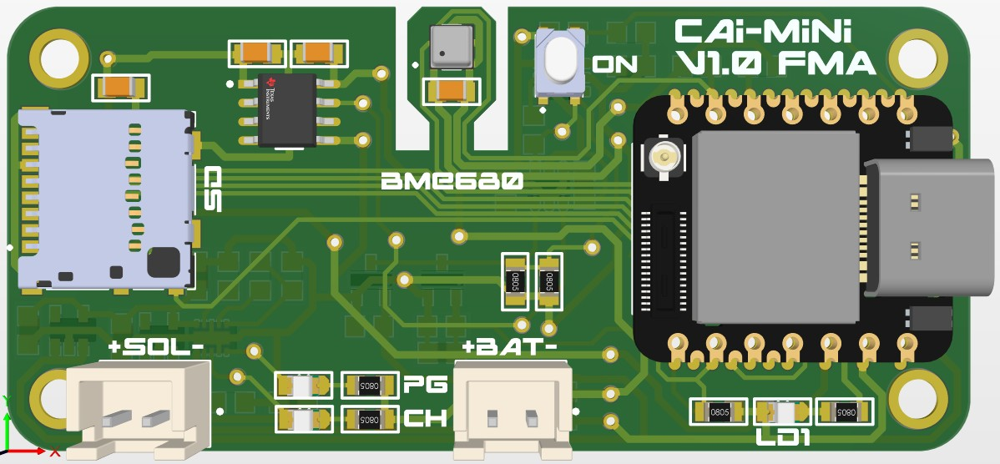
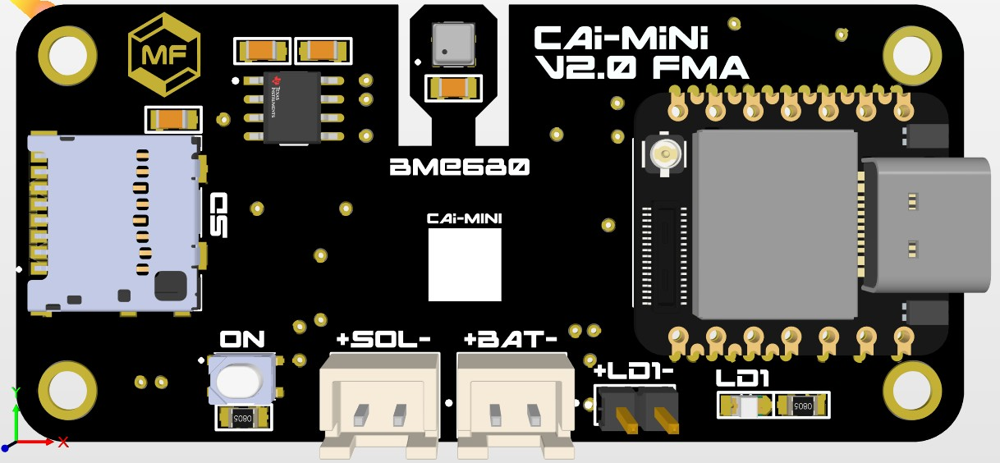

# CAI_MINI — Environmental Sensor Plattform

> Modulare IoT-Sensorplattform auf Basis des **Seeed XIAO ESP32-S3**
> zur Erfassung von Umweltdaten und Übertragung via **WLAN/MQTT** oder **LoRa**.

---

## Inhaltsverzeichnis

- [CAI-Mini PCB](#cai-mini-pcb)
- [Übersicht](#übersicht)
- [Hardware](#hardware)
- [Hardware-Varianten (HW1 / HW2)](#hardware-varianten-hw1--hw2)
- [Projektstruktur](#projektstruktur)
- [Environments / Betriebsmodi](#environments--betriebsmodi)
- [Konfiguration](#konfiguration)
- [LoRa-Stack](#lora-stack)
- [Verschlüsselung (LoRa)](#verschlüsselung-lora)
- [Bibliotheken / Dependencies](#bibliotheken--dependencies)
- [Eigene Klassen](#eigene-klassen)
- [Ablauf WLAN-Modus](#ablauf-wlan-modus)
- [Ablauf WIND-Modus](#ablauf-wind-modus)
- [Ablauf LoRa-Modi](#ablauf-lora-modi)
- [Datenlogging (SD-Karte)](#datenlogging-sd-karte)
- [Akkuspannung & Ladestand](#akkuspannung--ladestand)
- [Home Assistant Integration](#home-assistant-integration)
- [Firmware-Update (OTA)](#firmware-update-ota)
- [LED-Statusanzeige](#led-statusanzeige)
- [Build & Flash](#build--flash)
- [Montage / Halterung](#montage--halterung)
- [Autor](#autor)

---

## CAI-Mini PCB V1.0




## CAI-Mini PCB V2.0



---

## Übersicht

**CAI_MINI** ist eine modulare, energieeffiziente IoT-Sensorplattform. Das System erfasst Umweltdaten (Temperatur, Luftdruck, Luftfeuchtigkeit, Gaswiderstand) mit einem **BME680-Sensor** und überträgt diese entweder direkt via **WLAN zu ThingsBoard**, über ein **LoRa-Netzwerk** (Sensor → Router → Gateway → ThingsBoard), oder als Wetterstation mit **Wind- und Regenmessung** (WIND-Modus). Optional werden die Messwerte zusätzlich per **MQTT an Home Assistant** publiziert.

---

## Hardware

| Komponente          | Beschreibung                                        |
|---------------------|-----------------------------------------------------|
| **MCU**             | Seeed XIAO ESP32-S3                                  |
| **Sensor**          | BME680 (Temperatur, Druck, Feuchte, Gas)            |
| **Speicher**        | SD-Karte (SPI) — CSV-Datenlogging + INI-Config      |
| **Kommunikation**   | WLAN (802.11 b/g/n) **oder** LoRa (SX1262 / Wio-SX1262) |
| **Stromversorgung** | LiPo-Akku (3.0 V – 4.2 V, ADC-Messung, BQ24210-Charger) |
| **Konfiguration**   | INI-Datei auf SD-Karte (`/INIT.ini`), Fallback auf Flash/Test |
| **Status-LEDs**     | LED Orange (Status), LED Blau (Datensendung)        |
| **Wind (WIND)**     | Windfahne (ADC), Anemometer (Interrupt), Regenmesser (Interrupt) |

Als Gateway kann alternativ ein **Heltec Wireless Stick Lite V3** eingesetzt werden.

---

## Hardware-Varianten (HW1 / HW2)

Von den custom PCBs existieren zwei Revisionen. Sie unterscheiden sich **nur in der Pin-Belegung**, nicht in der Logik. Beide leben auf demselben `main`-Branch und werden über das Compile-Time-Flag **`-DHW_VERSION`** unterschieden (kein separater Git-Branch), damit Fixes am gemeinsamen Code beiden Versionen zugutekommen.

- **HW1** (`-DHW_VERSION=1`): u. a. `SHUTDOWN_PIN`, `SD_DETECT`; LoRa dauerhaft bestromt.
- **HW2** (`-DHW_VERSION=2`): u. a. `LORA_ENABLE` (LoRa schaltbar), `BATTERY_CHARGING`, `ON_BUTTON`; Sensor nutzt Deep Sleep.

Alle XIAO-basierten Rollen (WLAN, WIND, LoRa Sensor/Router/Gateway) besitzen die HW-Achse. Der **Heltec-Gateway** wird als eigenes Environment ohne HW-Achse gepflegt.

Die Pin-Belegung je Rolle und HW-Version liegt in `include/pins_*.h`.

---

## Projektstruktur

```
CAI_MINI/
│
├── platformio.ini                   ← Build-Konfiguration (alle Environments)
├── Example_ini_File/                ← Beispiel-INI-Dateien für alle Modi
│
├── src/
│   ├── WLAN/
│   │   └── main.cpp                 ← WLAN-Modus: Sensor → ThingsBoard via MQTT (Single-Shot)
│   ├── WIND/
│   │   ├── main.cpp                 ← Wind/Regen-Wetterstation mit WLAN
│   │   └── wind_rain.cpp/.h         ← Wind- und Regenmessungs-Klasse (ISR-basiert)
│   ├── LORA_SENSOR/
│   │   └── main.cpp                 ← LoRa Sensor: Daten erfassen & per LoRa senden
│   ├── LORA_ROUTER/
│   │   └── main.cpp                 ← LoRa Router: Pakete weiterleiten + eigenes Paket
│   └── LORA_GATEWAY/
│       ├── main.cpp                 ← LoRa Gateway: empfangen & via WLAN weitersenden (Dual-Core)
│       └── credentials.h            ← WLAN/TB-Zugangsdaten des Gateways (compile-time)
│
├── lib/
│   ├── BME680/    BME680_Sensor.h/.cpp    ← BME680 Sensor-Wrapper
│   ├── LORA/      LORA.h/.cpp             ← LoRa-Kommunikation (RadioLib SX1262, ACK, CSMA/CA)
│   │              SensorPacket.h/.cpp     ← Datenpaket-Struct + Parser (Gateway)
│   ├── SDCard/    sdcard.h/.cpp           ← SD-Karte, INI-Parsing, CSV-Logging, NVS-Fallback
│   ├── FirmwareUpdate/ FirmwareUpdater.h/.cpp ← OTA-Update via ThingsBoard HTTP
│   ├── homeassistant/  ha_mqtt.h/.cpp     ← Home Assistant MQTT-Discovery-Client
│   ├── battery/   battery.h/.cpp          ← Akkuspannungsmessung via ADC (Kennlinie)
│   ├── WIFI/      wifi_functions.h/.cpp   ← WLAN-Verbindungshelfer
│   ├── Time/      time_functions.h/.cpp   ← NTP-Zeitsynchronisation
│   └── log/       log.h/.cpp              ← Logging (Serial + optional Telnet, mutex-geschützt)
│
└── include/
    ├── config_*.h                   ← Firmware-Version je Rolle/HW-Version
    ├── pins_*.h                     ← Pin-Definitionen je Rolle/HW-Version
    └── aes_key.h                    ← LoRa-Schlüssel (ChaCha20) — gitignore!
```

---

## Environments / Betriebsmodi

Jede Rolle existiert als **HW1-** und **HW2-Variante** (ausser Heltec-Gateway):

| Environment                                          | Board         | Beschreibung                                                   |
|------------------------------------------------------|---------------|----------------------------------------------------------------|
| `CAI_MINI_WLAN_HW1` / `_HW2`                         | XIAO ESP32-S3 | WLAN, BME680 → ThingsBoard via MQTT, Single-Shot-Betrieb       |
| `CAI_MINI_WIND_HW1` / `_HW2`                         | XIAO ESP32-S3 | WLAN, BME680 + Wind + Regen → ThingsBoard, Dauerbetrieb        |
| `CAI_MINI_LORA_SENSOR_HW1` / `_HW2`                  | XIAO ESP32-S3 | LoRa: Sensordaten erfassen und senden                          |
| `CAI_MINI_LORA_ROUTER_HW1` / `_HW2`                  | XIAO ESP32-S3 | LoRa: Pakete empfangen, weiterleiten und eigenes Paket senden  |
| `CAI_MINI_LORA_GATEWAY_XIAO_S3_HW1` / `_HW2`         | XIAO ESP32-S3 | LoRa-Gateway (Dual-Core) → ThingsBoard, Telnet-Logging          |
| `CAI_MINI_LORA_GATEWAY_HELTEC_WIRELESS_STICK_LITE_V3`| Heltec WSL V3 | Gleiches Gateway auf Heltec-Board (keine HW-Achse)             |

---

## Konfiguration

### Datenquelle: 3-stufiger Fallback

`SDCard::readIni()` beschafft die Konfiguration in dieser Reihenfolge (`cfg` ist danach immer gefüllt):

1. **SD-Karte** — `/INIT.ini` wird gelesen und anschliessend in den **Flash (NVS)** gespiegelt.
2. **Flash (NVS)** — zuletzt gespeicherte Config, falls keine SD-Karte steckt.
3. **Testdaten** — kompilierte `SIM_*`-Defaults (siehe `sdcard.h`), falls weder SD noch Flash vorhanden sind. Per `-DSIM_*` in `platformio.ini` überschreibbar.

> **Ausnahme Gateway:** Der LoRa-Gateway liest seine WLAN-/ThingsBoard-Zugangsdaten **nicht** aus der INI, sondern aus `src/LORA_GATEWAY/credentials.h` (compile-time). Die Sensor-Tokens kommen pro Paket vom jeweiligen Sensor.

> ⚠️ `INIT.ini`, `credentials.h` und `aes_key.h` niemals in ein öffentliches Repo committen — in `.gitignore` eintragen.
> INI-Schlüssel müssen **exakt** den Lookup-Strings in `sdcard.cpp` entsprechen (case-sensitive, keine Leerzeichen um `=`).

### WLAN-Modus (`INIT_WLAN.ini`)

```ini
[WIFI]
SSID       = MeinNetzwerk
PW         = MeinPasswort

[THINGSBOARD]
TB_ADRESS  = iot.beispiel.ch
TB_TOKKEN  = mein-access-token
TB_PORT    = 1884

[BME680]
TEMPERATURE_OFFSET = -2.05
PRESSURE_OFFSET    = 0.0
HUMINITY_OFFSET    = 0.0
GAS_OFFSET         = 0.0

[HOMEASSISTANT]
HA_BROKER    = 192.168.2.11
HA_PORT      = 1883
HA_DEVICE_ID = CAI-Mini-00
HA_USER      = meinuser
HA_PASS      = meinpass
```

> Die `[HOMEASSISTANT]`-Section ist **optional** — fehlt `HA_BROKER`, wird HA übersprungen.

### WIND-Modus (`INIT_WIND.ini`)

Zusätzlich zu den WLAN-Feldern:

```ini
[GENERAL]
SENDING_PERIOD = 10       ; Sendeintervall in Minuten

[WIND]
DEVICE_DIRECTION  = 0.0    ; Geräteausrichtung in Grad (0° = Norden)
WIND_VANE_OFFSET  = 0.0
WIND_SPEED_OFFSET = 0.0

[RAIN]
RAIN_OFFSET = 0.0

[WINDADCVALUES]
WIND_Direction_TEST = 0   ; 1 = ADC-Rohwert-Ausgabe aktivieren
0  = 2937
1  = 1464
; … 16 Stützpunkte 0..15 (je 22,5°)
15 = 2603
```

### LoRa-Modi (`INIT_LORA_SENSOR.ini` / `_ROUTER` / `_GATEWAY`)

Zusätzlich zu Netzwerk/BME680 werden Absender/Empfänger konfiguriert:

```ini
[ID]
NAME = SENSOR_01          ; eigener Geräte-Name (DeviceID)

[SEND_TO]
NAME = ROUTER_01          ; Ziel-Name (SenderID / nächster Hop)
```

Vollständige Vorlagen für alle Modi liegen im Ordner `Example_ini_File/`.

---

## LoRa-Stack

| Parameter        | Wert            |
|------------------|-----------------|
| Frequenz         | 868.0 MHz       |
| Spreading Factor | SF12            |
| Bandbreite       | 125 kHz         |
| Coding Rate      | 4/7             |
| TX-Leistung      | 22 dBm          |
| Sync Word        | 0xB6            |

**Zugriffssteuerung:** Jitter + CSMA/CA vor dem Senden (RadioLib `scanChannel()`, bis zu 3 Runden mit 2–3 s Wartezeit bei besetztem Kanal). Übertragung mit ACK-Handshake und Retry (Default 3 Versuche). Der **Gateway** läuft Dual-Core über FreeRTOS: Core 0 empfängt LoRa und legt Pakete in eine Queue (Tiefe 8), Core 1 verarbeitet WiFi/MQTT/ThingsBoard.

---

## Verschlüsselung (LoRa)

Die LoRa-Nutzdaten werden mit **ChaCha20** (Stream-Cipher, `rweather/Crypto`) verschlüsselt und Base64-kodiert übertragen. Aktivierung über `#define LORA_ENCRYPTION_ENABLED` in `include/aes_key.h`.

- Schlüssellänge: **32 Byte** (ChaCha20-256), 8-Byte-IV wird je Paket zufällig erzeugt und dem Ciphertext vorangestellt.
- Schlüssel liegt in `include/aes_key.h` (**gitignore**).
- Produktionsschlüssel generieren mit: `openssl rand -hex 32`.

---

## Bibliotheken / Dependencies

| Bibliothek                        | Zweck                                     |
|-----------------------------------|-------------------------------------------|
| `adafruit/Adafruit BME680 Library`| BME680 Sensor-Treiber                     |
| `adafruit/Adafruit Unified Sensor`| Adafruit Sensor-Abstraktionsschicht       |
| `stevemarple/IniFile`             | INI-Datei-Parsing von SD-Karte            |
| `thingsboard/ThingsBoard`         | ThingsBoard MQTT Client                   |
| `thingsboard/TBPubSubClient`      | MQTT-Transport (ThingsBoard-Fork)         |
| `bblanchon/ArduinoJson` (v6)      | JSON-Serialisierung / -Parsing            |
| `jgromes/RadioLib @ 6.6.0`        | LoRa SX1262-Treiber (nur LoRa-Modi)       |
| `rweather/Crypto`                 | **ChaCha20**-Verschlüsselung (nur LoRa)   |
| `agdl/Base64`                     | Base64-Kodierung (nur LoRa-Modi)          |
| `jandrassy/TelnetStream`          | Telnet-Logging (nur Gateway-Modi)         |

Die MQTT-Persistenz der Config nutzt zusätzlich `Preferences` (NVS, im ESP32-Core enthalten).

---

## Eigene Klassen

### `BME680_Sensor`
Wrapper für den Adafruit BME680.

| Methode | Beschreibung |
|---|---|
| `begin()` | Sensor initialisieren |
| `set_offset(temp, press, hum, gas)` | Kalibrierungsoffsets setzen |
| `enable()` / `disable()` | Sensor bzw. Gas-Heater ein-/ausschalten |
| `readSensor()` | Messung durchführen |
| `getTemperature()` / `getPressure()` / `getHumidity()` / `getGasResistance()` | Messwerte |

### `wind_rain` (nur WIND-Modus)
Interrupt-basierte Klasse für Windfahne, Anemometer und Regenmesser (mit Debounce und Plausibilitäts-Clamps).

| Methode | Beschreibung |
|---|---|
| `begin(vane_off, speed_off, rain_off, direction, adc_table)` | Initialisierung |
| `enable_interrupts()` / `disable_interrupts()` | Messung ein-/ausschalten |
| `get_wind_direction_deg()` / `get_wind_direction_raw()` | Windrichtung (Grad / ADC-Rohwert) |
| `get_wind_average()` / `get_wind_gust()` | Mittelwind / Böe in m/s |
| `get_rain()` | Regenmenge in mm |
| `reset_all()` | Zähler zurücksetzen |

### `LORA`
LoRa-Kommunikation über RadioLib (SX1262): `begin()`, `transmit()` (mit ACK), `packetReceived()`, `readData()`/`readSender()`, `getLastRSSI()`/`getLastSNR()`, `sleepRadio()`. Verschlüsselung ist bei aktivem `LORA_ENCRYPTION_ENABLED` transparent integriert.

### `SDCard`
SD-Karten-Verwaltung, INI-Parsing, CSV-Logging und NVS-Fallback: `init()`, `readIni()`, `writeLog()`, `saveToFlash()`/`loadFromFlash()`, `release()`.

### `FirmwareUpdater`
OTA-Update via ThingsBoard-HTTP: `checkAndUpdate(server, token, version, useSD)` — direkt streamend oder über die SD-Karte.

### `HA_MQTT`
Home-Assistant-MQTT-Discovery-Client: `connect()`, `publishDiscovery()` (retained), `publishState()`, `disconnect()`.

---

## Ablauf WLAN-Modus

Single-Shot-Betrieb — das Gerät wacht auf, sendet, und fährt herunter (HW1: `SHUTDOWN_PIN`, HW2: Deep Sleep).

```
Einschalten → SD + INI lesen → BME680 init + Offsets → WLAN verbinden (Timeout 15 s)
→ OTA-Update prüfen → NTP-Zeit → BME680 + Akku messen → CSV-Log
→ ThingsBoard (Telemetrie + Attribute) → [optional] Home Assistant
→ kontrolliertes Shutdown
```

---

## Ablauf WIND-Modus

Dauerbetrieb mit konfigurierbarem Sendeintervall. CPU läuft zwischen den Sendungen im Sparmodus (10 MHz), Anemometer/Regenmesser zählen per Interrupt.

```
Einschalten → SD + INI (inkl. SENDING_PERIOD, ADC-Tabelle) → BME680 + wind_rain init
→ CPU 10 MHz, Interrupts aktiv → Loop bis Intervall abgelaufen
→ Interrupts aus, CPU 80 MHz → BME680 + Akku + Wind/Regen lesen (dann Reset)
→ WLAN + NTP → CSV-Log → OTA prüfen → ThingsBoard senden
→ WLAN trennen, CPU 10 MHz, Interrupts wieder aktiv
```

---

## Ablauf LoRa-Modi

```
LORA_SENSOR          LORA_ROUTER          LORA_GATEWAY
─────────────        ─────────────        ─────────────
Sensor lesen         Auf Paket warten     Auf Paket warten (Core 0)
    │                    │                    │
Paket aufbauen       Paket empfangen      Paket empfangen → Queue
(SensorPacket)       + ACK senden         + ACK senden
    │                    │                    │
ChaCha20 verschl.    RSSI anhängen        ChaCha20 entschlüsseln (Core 1)
    │                Weiterleiten             │
LoRa senden          + eigenes Paket      WLAN verbinden → ThingsBoard
+ auf ACK warten                          (Telemetrie senden)
```

---

## Datenlogging (SD-Karte)

Messdaten werden in `/data.csv` gespeichert. Der Header wird nur beim ersten Schreiben angelegt; fehlende Werte (NAN) erscheinen als leere Zellen. Ohne SD-Karte wird die Zeile stattdessen auf die Konsole ausgegeben.

```csv
Date,Temperature,Pressure,Humidity,Gas_Resistance,Battery_Voltage,Wind_Vane,Wind_Speed_Avg,Wind_Speed_Gust,Rain_Gauge
2026-05-31 18:30:00,22.45,952.30,48.30,125.60,3.87,270.0,3.2,5.8,0.0
```

---

## Akkuspannung & Ladestand

Die Spannung wird per ADC gemessen (Kennlinien-Interpolation in `battery.cpp`). Der Ladestand in Prozent wird linear berechnet und an ThingsBoard bzw. Home Assistant übertragen.

| Spannung | Ladestand |
|----------|-----------|
| 4.2 V    | 100 %     |
| 3.6 V    | 50 %      |
| 3.0 V    | 0 %       |

**Formel:** `Battery_Percentage = constrain((V - 3.0) / 1.2 * 100, 0, 100)`

---

## Home Assistant Integration

CAI_MINI unterstützt **MQTT Discovery** — Sensoren erscheinen automatisch in HA unter Einstellungen → Geräte & Dienste → MQTT.

**Voraussetzungen:** Mosquitto-Broker in HA, Login (User/Passwort), `[HOMEASSISTANT]`-Section in `/INIT.ini`.

| Sensor | Einheit | HA Device Class |
|---|---|---|
| Temperatur | °C | temperature |
| Luftdruck | hPa | atmospheric_pressure |
| Luftfeuchtigkeit | % | humidity |
| Gaswiderstand | kΩ | — |
| Batteriespannung | V | voltage |
| Batteriestand | % | battery |

**MQTT Topics:**
```
homeassistant/sensor/<device_id>/<messgrösse>/config   ← Discovery (retained)
cai_mini/<device_id>/state                             ← Messwerte (JSON)
```

> Die Discovery-Config wird mit `retained=true` gesendet — HA erkennt das Gerät auch nach einem Neustart.

---

## Firmware-Update (OTA)

Der `FirmwareUpdater` prüft nach der WLAN-Verbindung, ob ThingsBoard eine neue Firmware bereitstellt (Shared Attributes `fw_version`, `fw_title`, `fw_tag`).

- Neue Version → Download → Flash → Neustart (direkt streamend oder über SD).
- Gleiche Version → normaler Betrieb.

Die Firmware-Version wird über `FW_VERSION` in der jeweiligen `config_*.h` (pro Rolle und HW-Version) gesetzt.

---

## LED-Statusanzeige

| LED                     | Zustand           | Bedeutung                                     |
|-------------------------|-------------------|-----------------------------------------------|
| 🟠 Orange               | AN                | Gerät initialisiert / in Betrieb (Dauerzustand) |
| 🟠 Orange               | AUS (nur Router)  | Router sendet gerade sein eigenes Paket       |
| 🔵 Blau                 | AN                | Daten werden gesendet                         |
| 🔵 Blau                 | AUS               | Senden abgeschlossen / Ruhe                   |
| ⚪ LED_BOARD (Gateway)  | AN / blinkt       | Gateway aktiv, WLAN-Versuch oder Sendung      |

> Gilt für WLAN, WIND und LoRa-Sensor/Router. Der **Gateway** nutzt statt Orange/Blau nur `LED_BOARD`. Orange bleibt nach dem Setup dauerhaft an (kein „aus bei WLAN-Verbindung").

---

## Build & Flash

Environments folgen dem Schema `<ROLLE>_HW1` / `_HW2`. Beispiele (analog für HW1):

```bash
# WLAN (HW2) bauen und flashen
pio run -e CAI_MINI_WLAN_HW2 --target upload

# WIND (HW2)
pio run -e CAI_MINI_WIND_HW2 --target upload

# LoRa Sensor / Router (HW2)
pio run -e CAI_MINI_LORA_SENSOR_HW2 --target upload
pio run -e CAI_MINI_LORA_ROUTER_HW2 --target upload

# LoRa Gateway (XIAO S3, HW2)
pio run -e CAI_MINI_LORA_GATEWAY_XIAO_S3_HW2 --target upload

# LoRa Gateway (Heltec WSL V3)
pio run -e CAI_MINI_LORA_GATEWAY_HELTEC_WIRELESS_STICK_LITE_V3 --target upload

# Serial Monitor
pio device monitor --baud 115200

# Build-Cache leeren
pio run --target clean
```

---

## Montage / Halterung

Die Geräte werden über eine standardisierte Halterung montiert. Die Montageschnittstelle ist in der technischen Zeichnung dokumentiert:


Die Zeichnung zeigt den Befestigungsflansch mit den Hauptmassen: 50 mm Gesamtbreite (2× 25 mm), 45 mm Gesamthöhe (25 mm + 20 mm ab Mittelpunkt). In den Befestigungslöchern sind jeweils M3-Gewinde eingelassen.

---

## Autor

**Maran Friedli**
Erstellt: 2026-04-01
Plattform: [PlatformIO](https://platformio.org/) + [Arduino Framework](https://www.arduino.cc/)
Board: [Seeed XIAO ESP32-S3](https://wiki.seeedstudio.com/xiao_esp32s3_getting_started/)